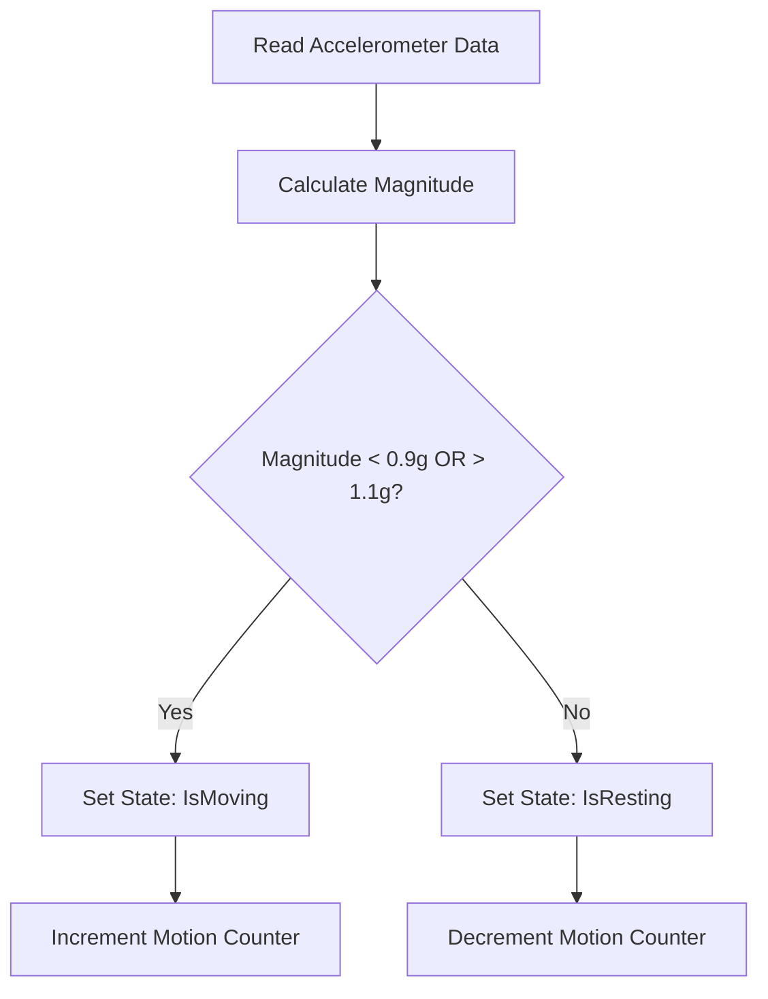
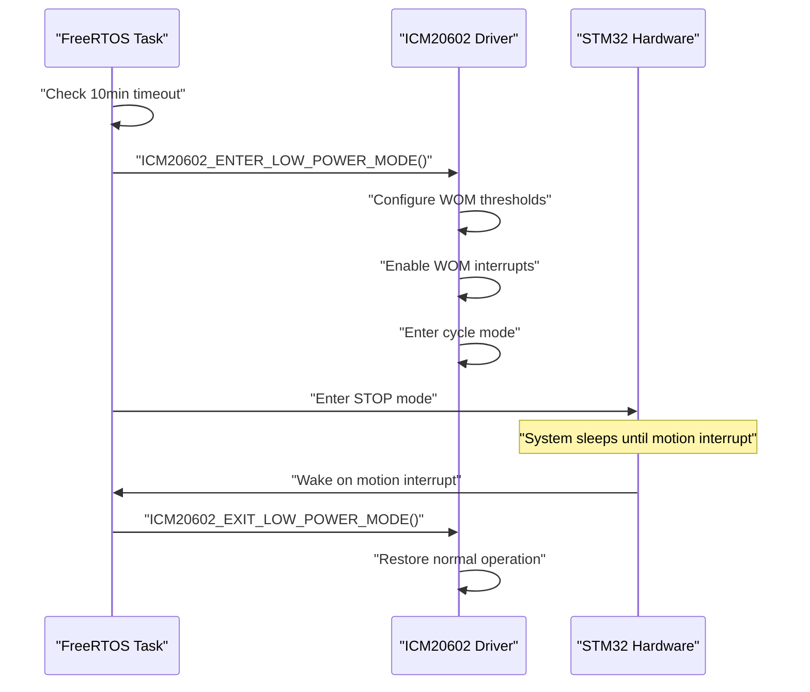

# ICM20602 IMU Driver Project README

This README provides comprehensive documentation for the STM32-based tap detection and sleep detection system using the ICM20602 IMU sensor. <cite/>

## 📁 Project Structure

### Core Components

The project is organized into several key modules that work together to provide motion detection and power management capabilities: <cite/>

```
📦 TapDetection-SleepDetection-based-on-ICM20602/
├── 📂 Core/
│   ├── 📂 Inc/
│   │   ├── 🔧 icm20602.h          # ICM20602 driver header
│   │   └── 🔧 tap_detection.h     # Tap detection algorithms
│   └── 📂 Src/
│       ├── ⚙️ main.c              # System initialization
│       ├── ⚙️ icm20602.c          # ICM20602 driver implementation
│       ├── ⚙️ tap_detection.c     # Tap detection logic
│       └── ⚙️ freertos.c          # FreeRTOS task management
├── 📂 MDK-ARM/                    # Keil project files
└── 📂 Drivers/                    # STM32 HAL drivers
``` [1](#0-0) 

### Hardware Platform

- **MCU**: STM32F103T8U6TR (ARM Cortex-M3)
- **IMU Sensor**: ICM20602 6-axis motion sensor
- **Communication**: I2C interface for sensor communication
- **Development Environment**: Keil MDK-ARM with STM32CubeMX configuration [2](#0-1) 

## 🚀 Core Features

### 1. **Intelligent Tap Detection** 🎯

The system implements sophisticated tap detection algorithms that differentiate between intentional taps and unintended movements: [3](#0-2) 

- **Multi-threshold Detection**: Uses acceleration (1.8g) and gyroscope (1.0rad/s) thresholds
- **Direction Analysis**: Tracks motion direction consistency and changes
- **Rebound Detection**: Identifies characteristic tap rebound patterns
- **State Machine**: 5-state detection process (IDLE → POTENTIAL → DIRECTION → CONFIRMED → SETTLE)

### 2. **Automatic Sleep Detection** 😴

Power-efficient sleep management based on motion activity monitoring: [4](#0-3) 

- **10-minute Inactivity Timer**: Automatically enters sleep mode after 10 minutes of no motion
- **Motion-based Wake-up**: Uses ICM20602's Wake-on-Motion (WOM) interrupts
- **Power State Management**: Coordinates between normal and low-power modes

### 3. **Advanced Power Management** 🔋

Comprehensive power optimization for extended battery life: [5](#0-4) 

- **STM32 STOP Mode**: CPU and peripherals enter low-power state
- **ICM20602 Cycle Mode**: Sensor operates in ultra-low-power wake-on-motion mode
- **Peripheral Management**: Selective disable/enable of UART and timer peripherals

## ⚙️ Core Logic Implementation

### Motion Detection Algorithm

The system uses magnitude-based motion detection with configurable thresholds: [6](#0-5) 



### Sleep Entry Process

The sleep detection system follows a structured approach to power management: [7](#0-6) 



### FreeRTOS Task Architecture

The system operates with two main tasks coordinated through FreeRTOS: [8](#0-7) 

- **TapDetection Task**: High-priority task handling sensor reading and motion analysis
- **Default Task**: Background task for system maintenance
- **Sleep Management**: Integrated into the main detection loop with activity tracking

## 🔧 Areas for Improvement

### 1. **Algorithm Optimization** 📈

- **Adaptive Thresholds**: Current motion detection uses fixed thresholds (0.9g-1.1g) that could be dynamically adjusted based on environmental conditions
- **Machine Learning Integration**: Implement ML-based tap pattern recognition for improved accuracy
- **Multi-axis Analysis**: Enhanced direction detection algorithms for better tap classification

### 2. **Power Management Enhancement** ⚡

- **Dynamic Sleep Timeout**: Currently fixed at 10 minutes, could be adaptive based on usage patterns
- **Graduated Power States**: Implement multiple power levels instead of binary normal/sleep modes
- **Battery Monitoring**: Add real-time battery level monitoring and low-battery alerts

### 3. **System Robustness** 🛡️

- **Error Recovery**: Improve I2C communication error handling and automatic recovery mechanisms [9](#0-8) 
- **Calibration System**: Implement automatic sensor calibration and offset compensation
- **Watchdog Integration**: Add system watchdog for enhanced reliability

### 4. **User Interface** 📱

- **Configuration Interface**: Add runtime parameter adjustment capabilities
- **Status Indicators**: Implement LED status indicators for different operational states
- **Data Logging**: Enhanced logging capabilities for debugging and analysis

### 5. **Code Architecture** 🏗️

- **Modular Design**: Further separation of concerns between detection algorithms and hardware drivers
- **Unit Testing**: Implement comprehensive unit tests for critical functions
- **Documentation**: Enhanced inline documentation and API reference

## Notes

The project demonstrates a well-structured embedded system combining real-time motion detection with intelligent power management. The ICM20602 driver provides the foundation for both tap detection and sleep management through its Wake-on-Motion capabilities. The FreeRTOS integration ensures responsive operation while maintaining power efficiency. The current implementation shows good separation between hardware abstraction and application logic, though there are opportunities for further optimization in algorithm sophistication and power management strategies.

Wiki pages you might want to explore:
- [Sleep Detection & Power Management (ShepherdDaiPH/TapDetection-SleepDetection-based-on-ICM20602)](/wiki/ShepherdDaiPH/TapDetection-SleepDetection-based-on-ICM20602#3.2)